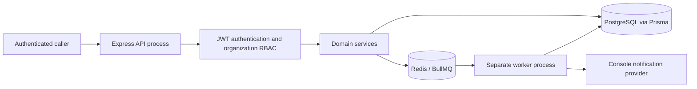
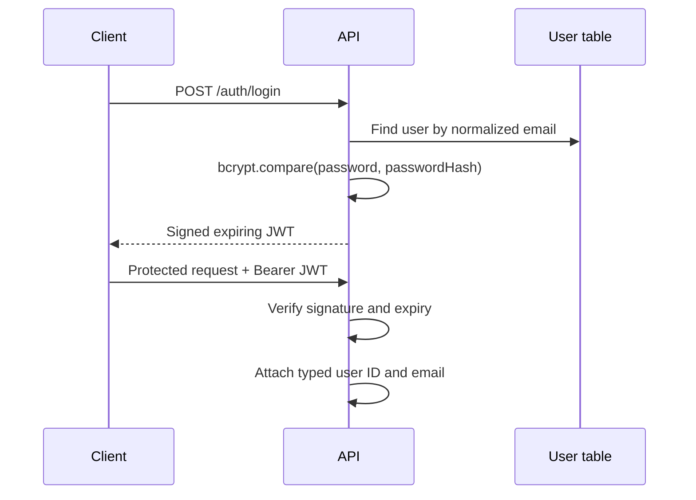
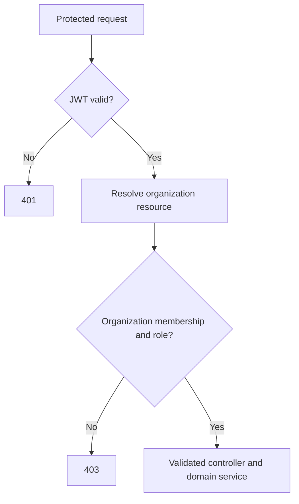
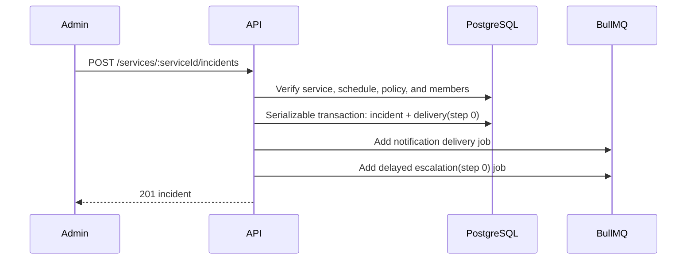

# PulseOps Architecture

## Current implementation

PulseOps is a **modular monolith**. One TypeScript codebase contains Express routes, domain services, Prisma persistence, BullMQ producers, a notification provider abstraction, and a separately started worker entry point. It is not a microservices system and does not claim multi-instance coordination.



## Component responsibilities

| Component                 | Responsibility                                                                                      |
| ------------------------- | --------------------------------------------------------------------------------------------------- |
| `src/app.ts`              | Express composition, security headers, JSON parsing, request logging, routes, and error middleware. |
| Authentication middleware | Verifies JWTs and exposes a typed authenticated user on the request.                                |
| Authorization middleware  | Resolves organization context from route resources and enforces `ADMIN`, `RESPONDER`, or `VIEWER`.  |
| Controllers and routes    | Map HTTP contracts to validated service calls and consistent responses.                             |
| Domain services           | Enforce tenant boundaries, lifecycle rules, ordered rotation behavior, and transactions.            |
| Prisma/PostgreSQL         | Persist durable relational state, constraints, indexes, and migrations.                             |
| BullMQ producer           | Adds immediate notification and delayed escalation jobs without blocking HTTP.                      |
| Worker                    | Processes jobs, retries failures through BullMQ, and safely checks durable state before effects.    |
| Notification provider     | Logs development notifications through a replaceable interface; no SMS or voice claim is made.      |

## Authentication flow



Passwords, hashes, and authorization headers are redacted from application logs. JWT secrets are runtime-only environment variables.

## Authorization flow

For an organization route, middleware uses `organizationId` from the route. For a team, service, or incident route, middleware retrieves the resource's owning organization before looking up `OrganizationMember(organizationId, userId)`. A role check then decides whether the route can execute.



This is defense in depth: route middleware scopes access before a service action, while service methods also require parent organization relationships for cross-resource mutations such as attaching a team to a service.

## Incident creation flow



The incident transaction calculates the initial responder from the rotation at creation time. The delivery record is unique on `(incidentId, step)`, so a future repeated write cannot create the same escalation effect twice.

## Escalation flow

```mermaid
sequenceDiagram
  participant Q as Delayed BullMQ job
  participant W as Worker
  participant DB as PostgreSQL
  participant N as Notification provider

  Q->>W: escalation(incidentId, expectedStep)
  W->>DB: Serializable read of incident, schedule, policy
  alt not TRIGGERED or step changed
    W->>W: Safe no-op
  else next rotation member exists
    W->>DB: Conditional step advance + create unique delivery
    W->>Q: Queue notification and next delayed escalation
    Q->>W: notification(deliveryId)
    W->>DB: Atomically claim delivery lease
    W->>N: Send console notification
    W->>DB: Mark delivery SENT
  else rotation exhausted
    W->>W: Log warning; leave incident for manual follow-up
  end
```

Acknowledge and resolve actions change durable incident state. They do not need to remove queued delayed jobs: queued jobs check the state and expected step before making changes, which makes late execution harmless.

## Queue and worker behavior

Each BullMQ job has up to five attempts with exponential backoff. Notification records move from `PENDING` to a short leased `PROCESSING` state only when an atomic conditional update wins. Replayed jobs whose record is already claimed or sent return successfully without another provider call.

The worker marks a notification `FAILED` after its final retry. On startup it enqueues persisted pending deliveries as reconciliation for a database success followed by interrupted queue publication. This is not a full transactional outbox: a prolonged Redis outage can still require operational intervention for delayed escalation scheduling.

## Concurrency decisions

| Risk                                            | Implemented safeguard                                                                                                    |
| ----------------------------------------------- | ------------------------------------------------------------------------------------------------------------------------ |
| Two workers process the same notification job   | Conditional delivery claim plus `PROCESSING` lease.                                                                      |
| Job retry creates duplicate incident escalation | Unique `(incidentId, step)` delivery, serializable transaction, and conditional expected-step update.                    |
| Acknowledgement races a delayed escalation      | Escalation only updates `TRIGGERED` incident at the expected persisted step.                                             |
| Rotation member changes during an incident      | Current step uses the incident creation timestamp and the persisted ordered schedule read in the escalation transaction. |
| Serializable PostgreSQL contention              | Transaction helper retries Prisma serialization failures (`P2034`) a bounded number of times.                            |
| Queue insertion fails after DB commit           | Initial and advanced delivery remain pending; worker startup reconciliation re-enqueues pending notifications.           |

## Design tradeoffs

The queue is deliberately not a distributed workflow engine. The database is authoritative for incident state and the worker is idempotent, so delayed jobs can be treated as prompts to evaluate current truth. The selected provider is console-only; an external delivery provider should be added through the `NotificationProvider` interface and should itself support idempotency keys.

An ordered rotation is intentionally simpler than calendar scheduling. It is predictable and explainable but does not provide holidays, time zones, overrides, or schedule types. Those are future capabilities, not hidden claims of the current implementation.
